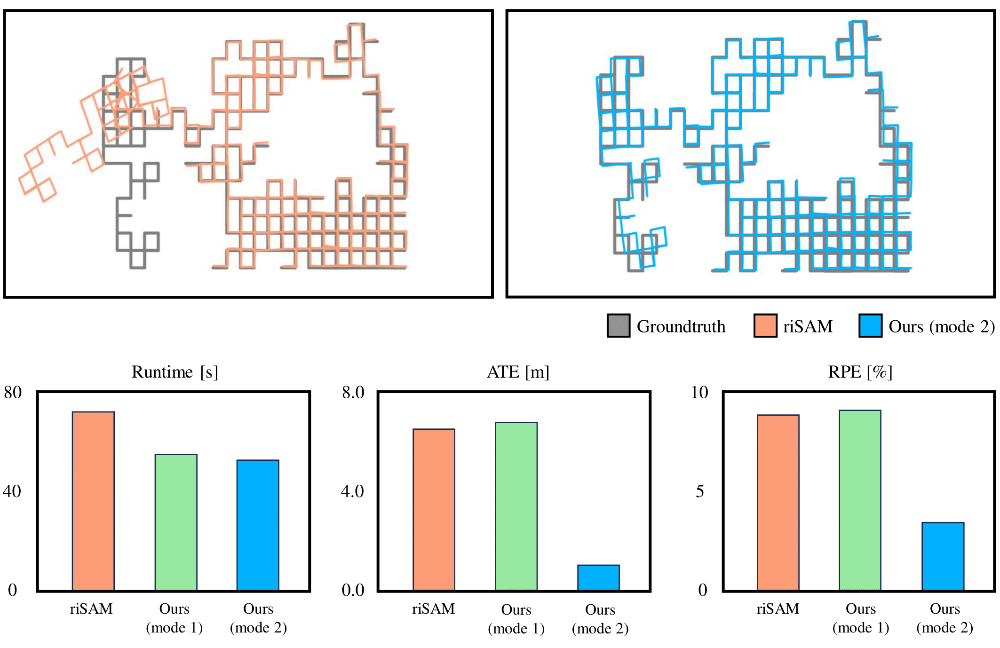

# Adaptive Graduated Non-Convexity for Pose Graph Optimization (AGNC-PGO)

Presented in IROS 2023 Workshop "ROBOTIC PERCEPTION AND MAPPING: FRONTIER VISION & LEARNING TECHNIQUES".

# Structure
* `experiments`: Contains the implementations for experiments.
* `risam`: Contains the implementation of the algorithm.

## Building Instructions (Validated as of Aug 2023)
* Version Summary (tested and confirmed with the following dependency versions)
    * GTSAM: Tag=4.2a8, exact hash=9902ccc0a4f62123e91f057babe3612a95c15c20
    * KimeraRPGO: exact hash=8c5e163ba38345ff583d87403ad53bf966c0221b
    * dcsam: exact hash=b7f62295eec201fb00ee6d1d828fa551ac1f4bd7
    * GCC: 11.4.0
* These should be checked out when the git submodules are initialized, but are included here for completeness

* GTSAM 
    * Download [GTSAM version 4.2a8](https://github.com/borglab/gtsam/releases/tag/4.2a8) **! 4.2a9 not working!**
    * Setup compile time options [required by KimeraRPGO](https://github.com/MIT-SPARK/Kimera-RPGO)
    * Build and optionally install GTSAM (Scripts assume GTSAM python is installed in the active python environment)
* Clone riSAM and Submodules
    * `git clone --recursive https://github.com/SNU-DLLAB/AGNC-PGO.git`
* Build GTSAM
    * Configure cmake with following options: `cmake .. -DGTSAM_POSE3_EXPMAP=ON -DGTSAM_ROT3_EXPMAP=ON -DGTSAM_USE_SYSTEM_EIGEN=ON`
* Link GTSAM
    * If you `install` GTSAM this should be automatic
    * If you are working with a local build of GTSAM set `GTSAM_DIR` and `GTSAM_INCLUDE_DIR` to the appropriate directories.
* Build AGNC-PGO with riSAM
    * `cd risam`
    * `mkdir build`
    * `cd build`
    * `cmake ..`
    * `make`

## Acknowlodgement
The original code is from "Robot Perception Lab - Carnegie Mellon University". link: https://github.com/rpl-cmu/risam
